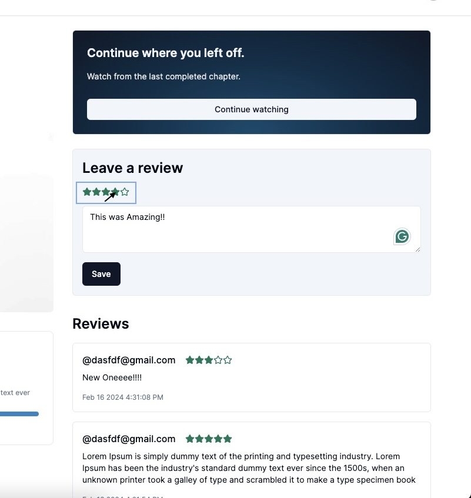

**Live Website**: [www.technologyfruit.com](https://www.technologyfruit.com/)

**Component chosen to be highlighted**: [RatingSystem](https://github.com/ApollosSevere/techfruit-fe-workspace/blob/main/app/(dashboard)/(routes)/teacher/courses/%5BcourseId%5D/_components/rating-system.tsx)

The RatingSystem component is a reusable React component that allows users to rate 
items by clicking on stars, with the ability to customize the number of stars displayed. 
Thanks for the opportunity :) 

 

# TechnologyFruit Frontend Workspace

Welcome to the TechnologyFruit Frontend Workspace repository! This application serves as a Course Management System.

# The Backend for this Web Application

Java SpringBoot Microservices deployed through AWS powers this application

| GitHub Link         | Description                              |
| :-------------- | :--------------------------------------- |
| [api-gateway](https://github.com/ApollosSevere/TechnologyFruit-Micorservices-Gateway-Service) | Directs all traffic to appropriate service |
| [auth-service](https://github.com/ApollosSevere/TechnologyFruit-Micorservices-Auth-Service) | Spring Boot 3.0 Security with JWT Implementation |
| [course-service](https://github.com/ApollosSevere/TechnologyFruit-Microservices-course-service) | Manages courses within the TechnologyFruit ecosystem |

# Microservices CI/CD Pipeline

This repository contains the configuration for a Continuous Integration/Continuous Deployment (CI/CD) pipeline for deploying microservices to an AWS EKS cluster.

## Pipeline Overview

The pipeline is defined using Jenkins declarative pipeline syntax. It consists of several stages, each responsible for a specific part of the deployment process:

1. **Git Checkout**: Checks out the code from the Git repository.

2. **Unit Test Maven**: Runs unit tests using Maven.

3. **Integration Test Maven**: Runs integration tests using Maven.

4. **Static Code Analysis: Sonarqube**: Analyzes the code for quality using SonarQube.

5. **Quality Gate Status Check: Sonarqube**: Checks the quality gate status in SonarQube.

6. **Maven Build: Maven**: Builds the project using Maven.

7. **AWS Image Build: ECR**: Builds Docker images and stores them in Amazon ECR (Elastic Container Registry).

8. **AWS Image Scan: Trivy**: Scans Docker images for vulnerabilities using Trivy.

9. **AWS Image Push: ECR**: Pushes Docker images to Amazon ECR.

10. **AWS Image Cleanup: ECR**: Cleans up old Docker images from Amazon ECR.

11. **Connect to EKS**: Configures access to the AWS EKS (Elastic Kubernetes Service) cluster.

12. **Deployment on EKS Cluster**: Deploys the application on the AWS EKS cluster using Kubernetes (kubectl).

## Pipeline Configuration

The pipeline is defined using Jenkins pipeline syntax. You can customize it by modifying the `Jenkinsfile-AWS-Pipeline` in this repository. Adjust the stages, parameters, and steps as needed to fit your project requirements.

